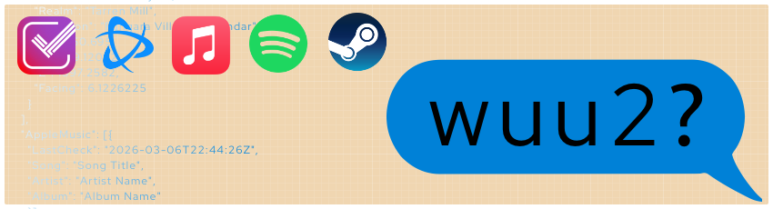

# wuu2
_________
## What You Up To?

A small application written in Go that uses APIs to see what you've been up to across TV, music, and games, returning it as a nicely accessible JSON.

- Trakt: a single last watched movie or TV show.
- World of Warcraft: character location and coordinates, as well as avatar
- More integrations planned, see wiki for details

### Getting Started

The easiest way to get going with wuu2 is by modifying the existing .env file and using the Docker image from [Dockerhub](https://hub.docker.com/r/wilderyns/wuu2/). 
```bash
docker run -p 8080:8080 --env-file .env wilderyns/wuu2:latest
```
Alternatively [install Go](https://go.dev/doc/install), clone this repository and run.
```bash
cd app
go run .
```
### Configuration

Full configuration steps including a complete explanation of each environment variable and setting up API access with the various providers is [available in the wiki](https://github.com/wilderyns/wuu2/wiki/Environment-Variables)

### Caveats

#### World of Warcraft
Although the intention was to use character coordinates to determine online status, the protected character API only updates when a player logs out. Keys supporting online and last online status are still included and updated, however they are in no way reliable. 
